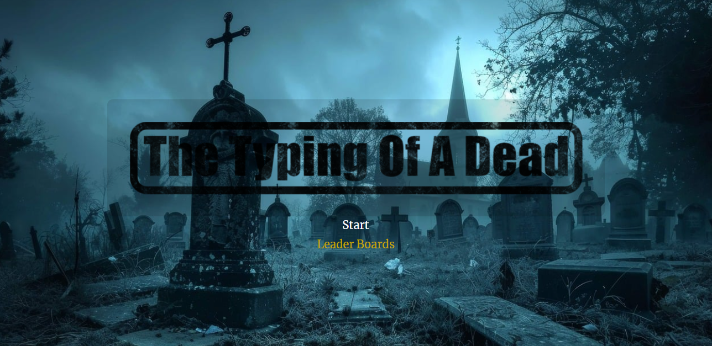
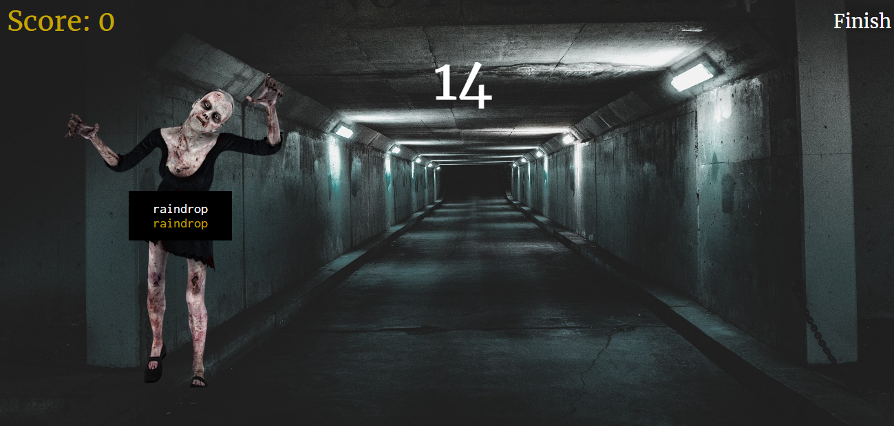

## Typing Of A Dead

Typing Of A Dead is an action-packed typing game where you eliminate waves of zombies by typing the correct words. Each word you type delivers a strike, keeping the undead at bay. Test your accuracy and speed. Will your typing skills be enough to survive the apocalypse?

## Tutorial

When the game loads, press Start to start the game.
There will be a short delay before the game fully begins.

 
<h3>Game On:</h3>
The background music will start playing, and the first zombie will appear.

 
<h3>How to Kill Zombies:</h3>
Type the displayed words accurately on your keyboard to kill the zombies.
No need to click anywhere on the screen—just start typing to play.

 

## Code Highlights

'''javascipt

listener(userInput, 'input', () => {
  let getInput = userInput.value;
  let char = getInput.slice(-1);
  compare(char);
});

setInterval(() => {
  if (startGame) {
    timeLimit--;
    timeCount.innerText = timeLimit;
    userInput.focus();
  }

  if (timeLimit === 0) {       
    printScore();
    switchScreen(false); 
    reset();
  }

  //looping home music
  countTime++; {
    if (countTime === 140) {
      homeMusic.currentTime = 0;
      countTime = 0;
    }
  }
}, 1000);
'''
Once you're done playing, your score will be saved automatically.
To view the leaderboard, go to the Menu and click the Leaderboard button.
